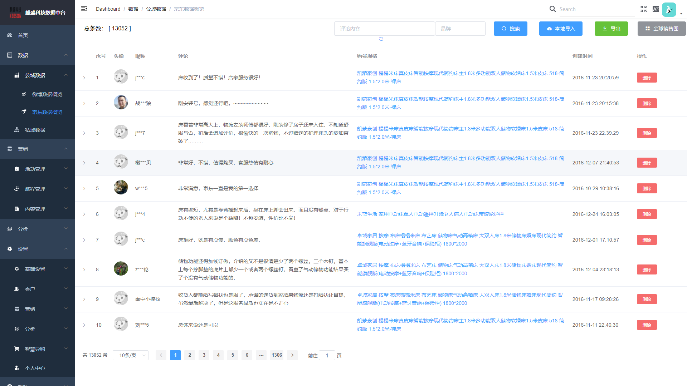
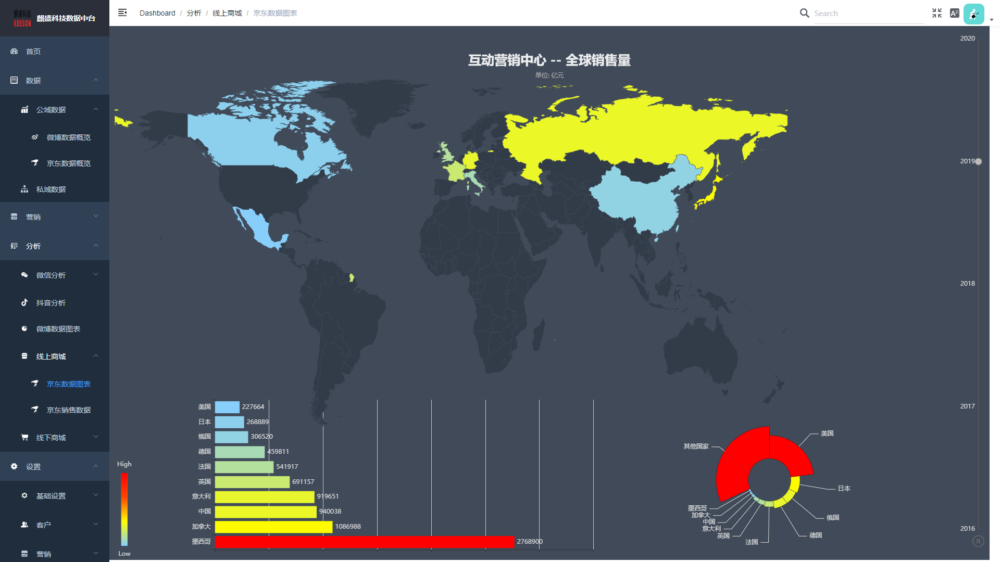
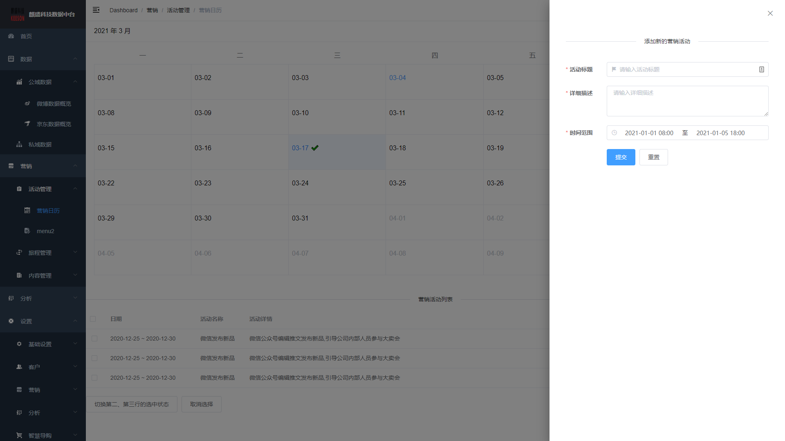
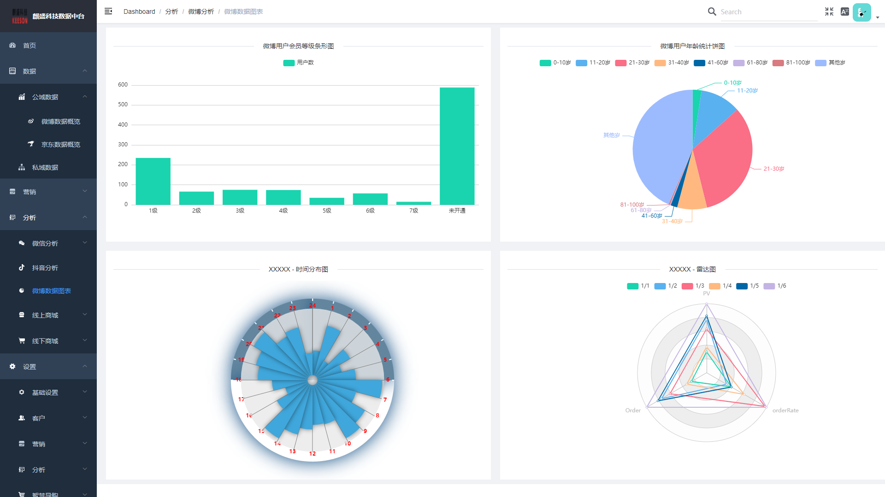
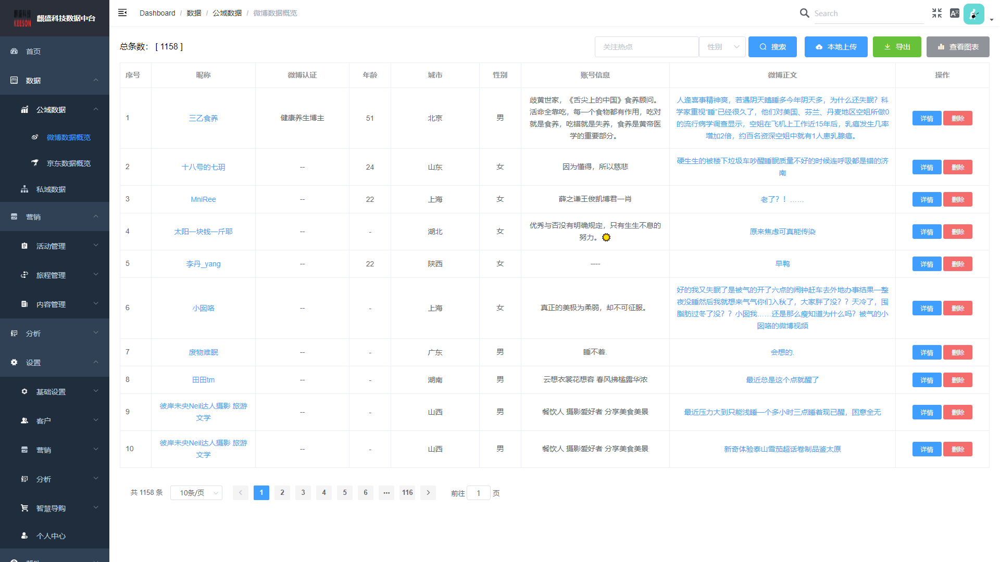
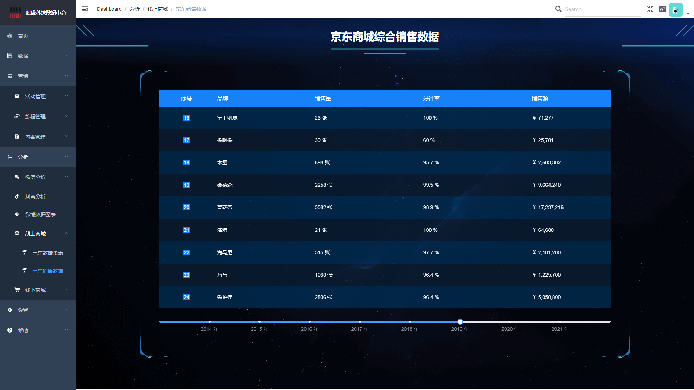

# 数据中台项目
## 项目描述：
基于vue技术栈实现的项目，使用element组件进行开发，采用前后端分离的开发模式。

## 主要功能：

主要是对数据进行展示、分析、管理。数据可分为公域数据和私域数据，公域数据来自微博、京东、淘宝、公众号、抖音等；私域数据来自企业内部。

## 技术要点：
1.使用vue-element-template构建项目的基本结构，Element-UI组件库中的部分功能进行快速开发,采用vue-router 配置 路由来处理各组件之间的通讯, axios请求服务器数据和权限校验;

2.采用cookie + Token 的方式验证用户登录; 

3.通过proxyTable+ Nginx服务器代理,解决跨域问题;

4.对Axios, Cookie 等组件进行封装;

5.采用mockjs在开发阶段模拟数据,实现前后端分离开发;

6.使用路由懒加载等方式对项目进行优化;

9.使用Webpack进行项目打包,实现代码优化功能;使用git 代码管理工具。

10.使用FileZilla  ftp工具连接云服务器,使用Ngnix将项目部署上线。

## 部分截图

